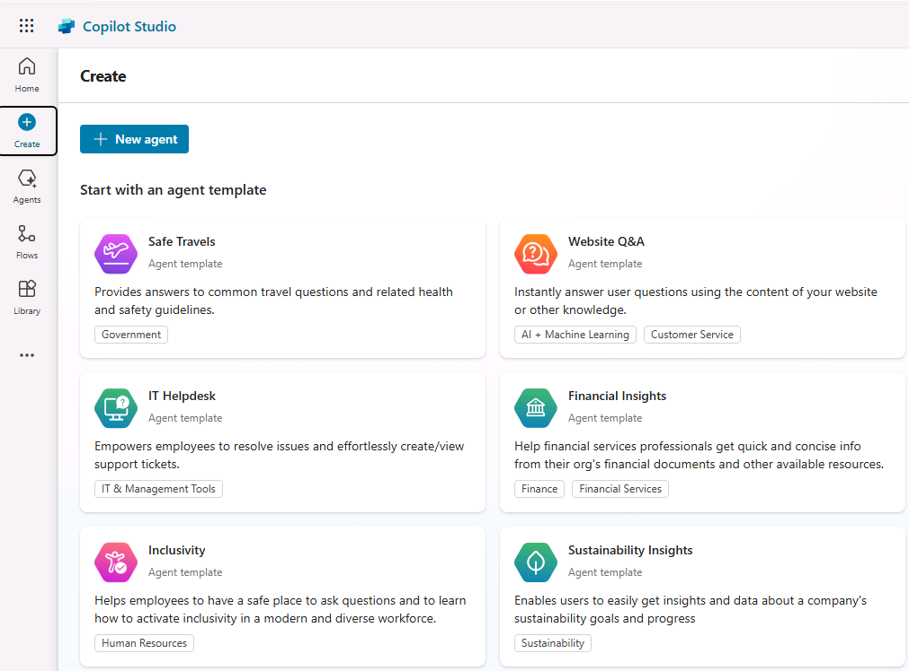

---
lab:
  title: "Créer un assistant avec Copilot\_Studio"
  module: Build an initial agent with Microsoft Copilot Studio
---

# Créer un assistant avec Copilot Studio

Dans cet exercice, vous allez utiliser Copilot Studio pour créer un agent simple qui peut répondre aux questions des employés sur les politiques de dépenses dans une société fictive.

Cet exercice devrait prendre environ **30** minutes.

> **Note** : pour cet exercice, vous devez disposer d’une licence Copilot Studio ou bénéficier d’un [essai gratuit](https://go.microsoft.com/fwlink/p/?linkid=2252605).

## Créer un agent

Commençons par utiliser Copilot Studio pour créer un agent. L’assistant aura initialement des capacités très limitées, que vous étendrez plus tard dans l’exercice.

1. Dans votre navigateur web, accédez à **Copilot Studio** à l’adresse `https://copilotstudio.microsoft.com/` et connectez-vous avec votre compte professionnel ou scolaire, si nécessaire. Ignorez les messages de bienvenue.

    > **Note :** la première fois que vous ouvrez Copilot Studio, il peut afficher une interface de conversation pour créer votre premier agent. Dans ce cas, cliquez sur le menu **...** en haut à droite (en regard du bouton **Créer**), puis sélectionnez **Annuler la création de l’agent**, puis quittez l’interface de conversation et affichez la page d’accueil de Copilot Studio.

1. La page d’accueil de Copilot Studio doit ressembler à ceci :

    

    Sur la page d’accueil, vous pouvez commencer à créer un agent et afficher les agents utilisés récemment. L’environnement **Power Apps** dans lequel vos agents sont définis est affiché en haut de la page. Vous pouvez également accéder à la page **Créer** pour plus d’options de création d’agent et à la page **Agents** pour afficher tous vos agents existants.

    > **Note** : en plus des agents que vous avez créés, vous pouvez voir **Copilot pour Microsoft 365**, que vous pouvez étendre à l’aide de Copilot Studio.

1. Dans le volet de navigation de gauche, sélectionnez **Créer** pour afficher une page sur laquelle vous pouvez créer un agent, comme suit :

    

    Vous pouvez créer un nouvel agent ou commencer par un modèle. Dans cet exercice, vous allez créer un nouvel agent.

1. Sélectionnez l’option pour créer un **Nouvel agent**. Copilot Studio répond en fournissant une interface de conversation dans laquelle vous pouvez décrire les fonctionnalités de l’agent que vous souhaitez générer.

    > **Conseil** : vous pouvez utiliser l’option **Passer à la configuration** pour ignorer l’expérience de création de l’agent basé sur les conversations. Dans cet exercice, nous allons utiliser l’interface de conversation.

1. Entrez l’invite suivante :

    ```prompt
    Create an agent to help employees with expense claims.
    ```

1. Lisez la réponse de Copilot Studio. Le volet de conversation doit ressembler à ce qui suit :

    

1. Poursuivez la conversation pour définir votre agent, qui doit :
    - Avoir un nom approprié
    - Utilisez un ton convivial et professionnel.
    - N’utilisez pas de sites web publics pour obtenir ses informations (vous ajouterez une source de connaissances à votre agent ultérieurement).
    - Évitez de donner des conseils fiscaux.

    Lorsque vous avez terminé, un aperçu de l’interface de conversation de votre agent s’affiche à côté de la conversation utilisée pour le créer.

1. Lorsque tout est prêt, sélectionnez **Créer** en haut à droite pour créer votre agent. Après un court instant, il s’affiche comme suit (vous pouvez désépingler le volet de gauche pour mieux le voir) :

    

1. Dans le volet **Tester votre agent**, entrez l’invite suivante :

    ```prompt
    Hello
    ```

    Lisez la réponse, qui doit être un message approprié.

1. Essayez maintenant l’invite qui suit :

    ```prompt
    Who should I contact about submitting an expense claim?
    ```

    Cette fois, la réponse peut être appropriée, mais elle est également susceptible d’être assez générale. Dans une organisation réelle, vous souhaitez que l’agent fournisse une adresse e-mail ou un numéro de téléphone que l’utilisateur ou l’utilisatrice puisse contacter.

1. Essayons une autre invite :

    ```prompt
    What's the expense limit for a hotel stay?
    ```

    Là encore, la réponse peut être appropriée mais générale. Dans une organisation réelle, vous souhaitez que l’agent fournisse une réponse plus spécifique basées sur les politiques de dépenses de l’entreprise.

1. Fermez le volet **Tester votre agent**.

## Gérer les *rubriques* dans votre agent

Vous pouvez utiliser des *rubriques* pour fournir des réponses explicites aux *déclencheurs*, comme des questions courantes que vos utilisateurs et utilisatrices vont certainement poser.

1. Sur la page de votre agent, sélectionnez l’onglet **Rubriques** pour afficher ses rubriques.

    

    L’agent comporte des rubriques ***Personnalisées*** déclenchées par l’entrée de l’utilisateur ou l’utilisatrice, et des rubriques ***Système*** supplémentaires déclenchées par des événements spécifiques, tels que des erreurs ou des entrées accidentelles. Vous pouvez filtrer les rubriques par catégorie ou utiliser le filtre **Tout** pour les afficher.

1. Sélectionnez la rubrique personnalisée **Salutations** pour l’afficher sur le *canevas de création*, qui est un concepteur visuel pour la création et la modification de rubriques et ressemble à ce qui suit :

    

    La rubrique *Salutations* est déclenchée par une entrée qui comporte l’une des expressions suivantes :

    - *Bonsoir*
    - *Bonjour*
    - *Bonjour*
    - *Coucou*
    - *Salut*

    La réponse à ce déclencheur consiste à renvoyer un message à l’utilisateur ou l’utilisatrice indiquant *Bonjour. Comment puis-je vous aider aujourd’hui ?*. L’inclusion de cette rubrique dans l’agent explique la réponse que vous avez vue précédemment lors du test.

1. Revenez à la page **Rubriques** et affichez les rubriques **Système**. Notez qu’elles incluent des rubriques pour les événements courants dans une conversation. Prenez particulièrement en compte les rubriques système suivantes :
    - **Boosting conversationnel** : cette rubrique est déclenchée lorsque l’utilisateur ou l’utilisatrice envoie un message dans lequel l’agent n’identifie aucune rubrique (l’*intention* de l’utilisateur ou l’utilisatrice est inconnue). La rubrique tente alors de répondre au message de l’utilisateur ou l’utilisatrice à l’aide de l’IA générative.
    - **De base** : cette rubrique est « de secours » qui répond lorsque l’intention est inconnue et qu’il est impossible de générer une réponse d’IA conversationnelle appropriée. La rubrique de base inclut la logique permettant à l’utilisateur ou l’utilisatrice de réessayer jusqu’à trois fois avant de mettre cordialement fin à la conversation, souvent en passant à un opérateur humain.
1. Revenez à la page **sujets**, puis dans le menu **+ Ajouter un sujet**, sélectionnez **sujet** \> **Ajouter à partir d’une description avec Copilot**.

1. Dans la boîte de dialogue **Ajouter à partir d’une description avec Copilot**, nommez la nouvelle sujet `Ask about expenses contact` et entrez le texte suivant pour indiquer à Copilot Studio ce que le sujet doit faire :

    ```prompt
    When the user asks who to contact about expense claims, tell them to send an email to finance@contoso.com
    ```
    > **Remarque** : Les résultats de Copilot peuvent varier, donc vous devrez peut-être jouer avec cette invite pour vos résultats attendus. 

1. Sélectionnez **Créer**.

1. Si vous y êtes invité, sélectionnez **Autoriser** pour **voir le texte et les images copiés dans le presse-papiers**.

1. Après une courte attente, une nouvelle rubrique nommée *Demander un contact pour les dépenses* doit être créée et ouverte dans le canevas de création, où elle devrait ressembler à ce qui suit :

    

    La nouvelle rubrique doit être déclenchée par des expressions qui demandent un contact pour les dépenses et répondre avec un message indiquant à l’utilisateur ou l’utilisatrice d’envoyer un e-mail à l’adresse appropriée.

    > **Important** : si les nœuds de la rubrique sont différents de l’image ci-dessus, supprimez la rubrique et créez à nouveau la rubrique.

1. Utilisez le bouton **Enregistrer** (en haut à droite) pour enregistrer la nouvelle rubrique dans votre assistant.

1. Ouvrez le volet **Test** et entrez l’invite suivante :

    ```prompt
    Who should I contact about submitting an expense claim?
    ```

    Affichez la réponse, qui doit se baser sur la rubrique que vous venez d’ajouter (même si le texte que vous avez entré ne correspond pas exactement aux expressions du déclencheur, il doit en être assez proche au niveau sémantique pour déclencher la rubrique).

## Ajouter une source de connaissances pour les réponses d’IA générative

Vous pouvez ajouter des rubriques pour toutes les entrées que les utilisateurs et utilisatrices saisiront probablement ; mais vous ne pouvez pas anticiper toutes les questions qui seront posées. Actuellement, votre agent utilise un *Boosting conversationnel* pour générer des réponses d’IA à partir d’un modèle de langage, mais cela entraîne des réponses générales. Vous devez fournir une source de connaissances sur laquelle les réponses d’IA génératives peuvent *s’appuyer* pour fournir des informations plus pertinentes.

1. Ouvrez un nouvel onglet de navigateur, téléchargez le fichier du [document de politique de dépenses](https://raw.githubusercontent.com/MicrosoftLearning/mslearn-copilotstudio/main/expenses/Expenses_Policy.docx) à partir de `https://github.com/MicrosoftLearning/mslearn-copilotstudio/raw/main/expenses/Expenses_Policy.docx`, et enregistrez-le localement. Ce document contient les détails de la politique des dépenses pour la société Contoso fictive.

1. Revenez à l’onglet navigateur de Copilot Studio et fermez le volet **Tester votre agent** pour mieux visualiser la page, puis sélectionnez l’onglet **Connaissances** pour afficher les sources de connaissances définies dans votre agent (il ne devrait y en avoir aucune pour le moment).

    

1. Sélectionnez **+ Ajouter des connaissances**, puis notez les différents types de sources de connaissances que vous pouvez ajouter à votre agent.

    

1. Dans la section **Charger un fichier**, chargez le document de politique de dépenses que vous avez téléchargé précédemment et ajoutez-le aux connaissances de votre agent.

    > **Note** : après le chargement du fichier, vous devez attendre 10 minutes (ou plus) que son indexation soit effectuée. C’est le moment idéal pour faire une pause café pendant que vous examinez le [document de politique des dépenses](https://github.com/MicrosoftLearning/mslearn-copilotstudio/raw/main/expenses/Expenses_Policy.docx) sur `https://github.com/MicrosoftLearning/mslearn-copilotstudio/raw/main/expenses/Expenses_Policy.docx` dans autre onglet de navigateur !

1. Lorsque le fichier est prêt, affichez la page **Rubriques** et ouvrez la rubrique système **Boosting conversationnel**. Rappelez-vous que cette rubrique est déclenchée par une intention inconnue, puis tente de créer une réponse d’IA générative basée sur des sources de données contenant des connaissances telles que le fichier que vous avez chargé.

    > **Note** : si aucune réponse pertinente n’est trouvée dans les sources de connaissances personnalisées que vous avez ajoutées, la rubrique peut utiliser les connaissances inhérentes au modèle de langage afin de fournir une réponse plus générale. Vous pouvez configurer la rubrique de manière à restreindre sa recherche à des bases de connaissances spécifiques si vous souhaitez contrôler davantage les réponses d’IA génératives qu’elle renvoie.

1. Développez le volet **Test** et redémarrez la conversation. Entrez ensuite l’invite suivante :

    ```prompt
    What's the expense limit for a hotel stay?
    ```

    La réponse doit être basée sur les informations de la source de connaissances que vous avez chargée et inclure une référence de citation.

    

1. Essayez de poser des questions de suivi, telles que :
    - `What about flights?`
    - `What guidelines are there for entertainment expenses?`

## Publier votre agent

Maintenant que vous disposez d’un agent opérationnel, vous pouvez le publier pour que les utilisateurs et les utilisatrices puissent s’en servir. Les canaux disponibles par le biais desquels vous pouvez fournir votre agent dépendent du type d’authentification que vous souhaitez utiliser pour y restreindre l’accès. Dans ce cas, vous allez activer l’accès pour tout le monde, puis publier l’agent et l’utiliser dans une page web de démonstration.

1. Masquez le volet **Tester votre agent**. Ensuite, en haut de la page, sélectionnez l’onglet **Canaux** et passez en revue les canaux sur lesquels vous pouvez déployer votre agent. Les canaux disponibles dépendent des paramètres d’authentification de votre agent.
1. Sélectionnez **Paramètres** en haut de la page.
1. Dans le volet **Paramètres**, sur la page **Sécurité**, sélectionnez **Authentification**. Sélectionnez ensuite l’option **Pas d’authentification** et **Enregistrez** les modifications de la configuration, puis **Enregistrez** une nouvelle fois (en confirmant que vous souhaitez activer l’accès à l’agent pour tout le monde).
1. Fermez le volet **Paramètres**. Ensuite, affichez la page **Canaux**.
1. sélectionnez **Publier** en haut de la page. Ensuite, sur la page **Publier**, sélectionnez **Publier**. La publication prend environ une minute.
1. Une fois votre agent publié, vérifiez le **Statut de la publication** sur la page **Canaux**.

    

1. Sélectionnez le canal **Site web de démonstration**. Il s’agit d’un canal approprié pour que les utilisateurs et utilisatrices testent votre agent.
1. Dans le volet **Site web de démonstration**, entrez les paramètres suivants :
    - **Message de bienvenue** : `Ask me about Expense claims`
    - **Amorces de conversation** :

        ```prompt
        "Hello"
        "Who should I contact with expense enquiries?"
        "What are the expense limits for flights?"`
        ```

1. Sélectionnez **Enregistrer** pour enregistrer les paramètres. Ensuite, **copiez** le lien vers votre site web de démonstration de l’agent dans le Presse-papiers.
1. Dans un nouvel onglet du navigateur, accédez à l’URL que vous avez copiée pour ouvrir le site web de démonstration, qui doit ressembler à ce qui suit :

    

1. Entrez le message `What are the expense limits for meals?` et lisez la réponse.
1. Essayez quelques questions supplémentaires et lisez les réponses de votre agent. Il aura des fonctionnalités limitées, mais devrait être en mesure de fournir des réponses pertinentes aux questions sur les notes de frais.

## Défi

Maintenant que vous avez vu comment utiliser Copilot Studio pour créer un agent simple, il est temps d’appliquer ce que vous avez appris. Essayez de créer un agent qui fournit des réponses aux questions sur Microsoft Copilot !

- Créer un agent
- Utilisez le site web `https://www.microsoft.com/en-us/microsoft-copilot/` comme source de connaissances.
- Publiez l’agent afin que les utilisateurs et les utilisatrices puissent le tester dans un site web de démonstration.

> **Conseil** : si vous avez besoin d’aide, consultez la [documentation de Copilot Studio](https://learn.microsoft.com/microsoft-copilot-studio/) à l’adresse `https://learn.microsoft.com/microsoft-copilot-studio/`.
