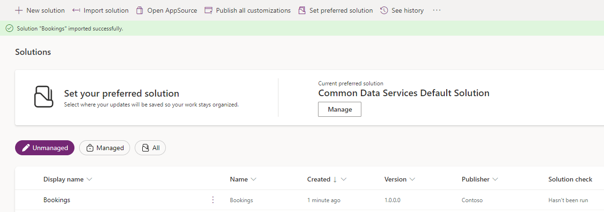

---
lab:
  title: Importer une solution Dataverse
  module: Course Introduction
---

# Importer une solution Dataverse

Dans cet exercice, vous allez importer une solution Dataverse que vous utiliserez dans les prochains labos.

> **Note** : pour cet exercice, vous devez disposer d’une licence Copilot Studio ou bénéficier d’un [essai gratuit](https://go.microsoft.com/fwlink/p/?linkid=2252605) et avoir un environnement Power Apps dans lequel travailler.

## Exercice 1 – Importer une solution

Dans cet exercice, vous allez importer une solution Dataverse dans votre environnement qui contient les tables nécessaires pour effectuer les labos.

### Tâche 1.1 : Se connecter à Power Apps

1. Dans un nouvel onglet de navigateur, accédez à `https://make.powerapps.com`.

1. Si l’on vous demande vos informations d’identification, connectez-vous avec votre adresse e-mail et votre mot de passe.

1. Si l’on vous demande vos coordonnées, définissez le pays/la région, puis sélectionnez **Démarrer**.

1. En haut à droite de l’écran, vérifiez que l’**environnement** est défini sur votre environnement. C’est là que vous allez travailler pendant toute la durée des labos. Si ce n’est pas le cas, sélectionnez l’environnement approprié.

### Tâche 1.2 – Télécharger la solution

1. Accédez à [**Bookings_1_0_0_0.zip**](../../Allfiles/Bookings_1_0_0_0.zip) dans GitHub. Le fichier se trouve à l’adresse `https://github.com/MicrosoftLearning/mslearn-copilotstudio/blob/main/Allfiles/Bookings_1_0_0_0.zip`.

1. Sélectionnez les **points de suspension (...)** en haut à droite, puis **Télécharger**.

### Tâche 1.3 – Importer une solution

1. Accédez à `https://make.powerapps.com`.

1. Vérifiez que vous êtes dans l’environnement approprié.

1. Dans le volet de navigation de gauche, sélectionnez **Solutions**.

1. Dans la barre supérieure, sélectionnez **Importer une solution**.

1. Sélectionnez **Parcourir** et localiser le fichier **Bookings_1_0_0_0.zip**, puis sélectionnez **Ouvrir**.

    

1. Sélectionnez **Suivant**.

1. Cliquez sur **Importer**.

    La solution est importée en arrière-plan. Cela peut prendre quelques minutes.

    

    > **Avertissement :** attendez que la solution ait terminé l’importation avant de passer à l’étape suivante.

1. Une fois la solution importée, ouvrez la solution **Bookings**.

1. Dans le volet de navigation de gauche, sélectionnez l’onglet **Vue d’ensemble**.

    

1. Sélectionnez **Publier toutes les personnalisations**.

### Tâche 1.4 – Tester les données

1. Dans le volet de navigation gauche de la solution Bookings, sélectionnez l’onglet **Objets**.

1. Sélectionnez le menu **points de suspension (...)** de l’application pilotée par modèle **Gestion des propriétés immobilières**, puis sélectionnez **Lire**.

    

1. Cliquez sur **+ Nouveau**.

1. Saisissez les informations suivantes :

    - **Nom de propriété :** `1100 High Villas`
    - **Prix demandé :** `250,000`
    - **Rue :** `Main Avenue`
    - **Ville :** `Redmond`
    - **Chambres :** `3`
    - **Salles de bain :** `2`

    

1. Cliquez sur **Enregistrer et fermer**.

1. Cliquez sur **+ Nouveau**.

1. Saisissez les informations suivantes :

    - **Nom de propriété :** `555 Oak Lane`
    - **Prix demandé :** `300,000`
    - **Rue :** `Oak Lane`
    - **Ville :** `Denver`
    - **Chambres :** `4`
    - **Salles de bain :** `3`

    

1. Sélectionnez **Enregistrer et fermer**.
