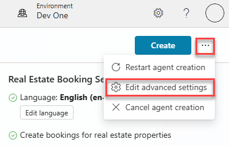
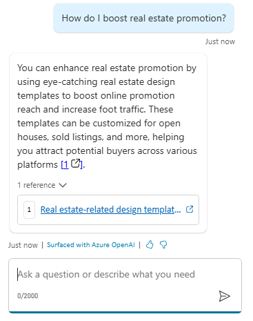

---
lab:
  title: Créer un agent initial
  module: Manage topics in Microsoft Copilot Studio
---

# Créer un agent initial

## Scénario

Dans cet exercice, vous allez :

- Créer et nommer un agent
- Ajouter une description de ce que l’assistant doit faire
- Configurer les réponses de l’IA générative

Cet exercice devrait prendre environ **15** minutes.

## Contenu du didacticiel

- Comment créer un assistant en utilisant le langage naturel
- Comment configurer des réponses d’IA générative pour un assistant

## Étapes de labo de haut niveau

- Créer un agent
- Indiquer à l’assistant quel est son objectif principal et comment il doit agir
- Configurer les instructions de l’IA générative
  
## Prérequis

- Avoir effectué le **Labo : importer une solution Dataverse**

## Exercice 1 : créer un assistant

Dans cet exercice, vous allez accéder au portail Microsoft Copilot Studio, à l’environnement de développeur et créer un assistant.

### Tâche 1.1 – Portail Microsoft Copilot Studio

1. Dans un nouvel onglet, accédez au portail de création Microsoft Copilot Studio `https://copilotstudio.microsoft.com` et connectez-vous avec vos informations d’identification Microsoft 365 si nécessaire.

1. Assurez-vous que vous êtes dans l’environnement approprié.

### Tâche 1.2 : créer un assistant

1. Sélectionnez **Créer** dans le volet de navigation de gauche, puis sélectionnez **+ Nouvel agent** et **Passer à la configuration** en haut à droite.

1. Dans la zone de texte **Nom**, entrez **`Real Estate Booking Service`**.

1. Dans la zone de texte **Description**, entrez **`Create bookings for real estate properties`**.

1. Dans la zone de texte **Instructions**, entrez **`Create an agent for topics relating to creating bookings for real estate properties`**.

1. En haut, la **langue** doit être définie sur **English (en-US)**.

    

1. En haut à droite de la page, sélectionnez les **trois points**, puis **Modifier les paramètres avancés**.

    

1. Sélectionnez **Bookings** sous **Solution**.

1. Entrez `labagent` pour **Nom du schéma**.

    

1. Cliquez sur **Enregistrer**.

1. Sélectionnez **Créer** en haut à droite de l’écran.

1. Dans le volet **Test de droite de votre agent**, entrez **`How do I make a booking?`** et affichez la réponse.

Laissez cette fenêtre ouverte.

## Exercice 2 – Ajouter des réponses d’IA générative

Dans cet exercice, vous allez accéder au portail Microsoft Copilot Studio et ajouter des connaissances que l’agent utilisera pour répondre aux questions à l’aide de l’IA générative.

### Tâche 2.1 - Désactiver l’orchestration générative

1. Sous l’onglet **Vue d’ensemble**, vérifiez que l’option **Utiliser l’IA générative pour déterminer la meilleure façon de répondre aux utilisateurs et aux événements.** est définie sur **Désactivé** dans la section **Détails**. Cela désactive l’orchestration à des fins de ce laboratoire.

    

### Tâche 2.2 – Ajouter une source de connaissances

1. Sélectionnez l’onglet **Connaissances**.

    

1. Sélectionnez **+ Ajouter des connaissances**.

1. Sélectionnez **Sites web publics**.

1. Dans la zone de texte **Lien du site web public**, entrez **`https://create.microsoft.com/en-us/`**.

    

1. Sélectionnez **Ajouter**.

1. Sélectionnez **Ajouter**.

1. Sélectionnez l’onglet **Vue d’ensemble**.

1. Sélectionnez les **trois points** en haut du volet **Tester votre agent**.

1. Activez **Suivi des rubriques**.

    

1. En haut du volet **Tester votre agent**, sélectionnez l’icône **Commencer une nouvelle conversation** (icône d’actualisation).

    

1. Dans la zone de texte **Poser une question ou décrire ce dont vous avez besoin**, entrez **`How do I boost real estate promotion?`**. Affichez votre réponse. 

    
