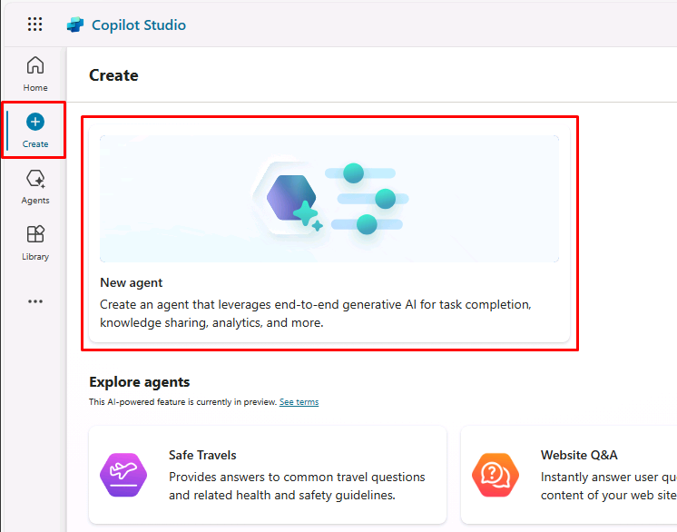
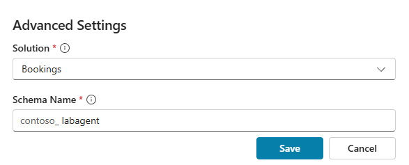
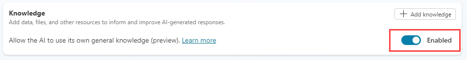
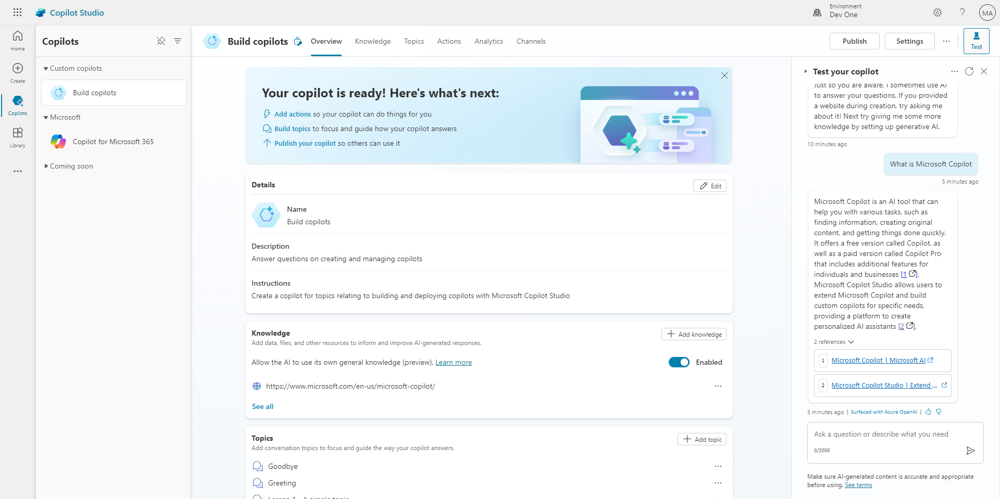

---
lab:
  title: Créer un copilote initial
  module: Build an initial copilot with Microsoft Copilot Studio
---

# Créer un copilote initial

## Scénario

Dans ce labo, vous allez :

- Créer et nommer un copilote
- Ajouter une description de ce que le copilote doit faire
- Configurer les réponses de l’IA générative

## Contenu du didacticiel

- Comment générer un copilote en utilisant le langage naturel
- Guide pratique pour configurer des réponses d’IA générative pour un copilote

## Étapes de labo de haut niveau

- Créer un nouveau copilote.
- Indiquer au copilote quel est son objectif principal et comment il doit agir
- Configurer les instructions de l’IA générative
  
## Prérequis

- Avoir effectué le **Labo : importer une solution Dataverse**

## Exercice 1 – Créer un copilote

Dans cet exercice, vous allez accéder au portail Microsoft Copilot Studio, à l’environnement de développeur et créer un copilote.

### Tâche 1.1 – Portail Microsoft Copilot Studio

1. Dans un nouvel onglet, accédez au portail de création Microsoft Copilot Studio `https://copilotstudio.microsoft.com` et connectez-vous avec vos informations d’identification Microsoft 365 si nécessaire.

1. Si cela vous est proposé, sélectionnez **Démarrer l’essai gratuit**.

1. Assurez-vous que vous êtes dans l’environnement approprié.

### Tâche 1.2 – Créer un copilote

1. Sélectionnez **Créer** dans le volet de navigation gauche, puis sélectionnez la vignette **Nouvel agent**.

    

1. Dans la zone de texte **Nom**, entrez **`Real Estate Booking Service`**.

1. Dans la zone de texte **Description**, entrez **`Create bookings for real estate properties`**.

1. Dans la zone de texte **Instructions**, entrez **`Create a copilot for topics relating to creating bookings for real estate properties`**.

1. En haut, la **langue** doit être définie sur **English (en-US)**.

    

1. En haut à droite de la page, sélectionnez les **trois points**, puis **Modifier les paramètres avancés**.

    

1. Sélectionnez **Bookings** sous **Solution**.

1. Entrez `labcopilot` pour **Nom du schéma**.

    

1. Cliquez sur **Enregistrer**.

1. Sélectionnez **Créer** en haut à droite de l’écran.

1. Dans le volet **Tester votre agent** à droite, entrez **`How do I make a booking?`**. Affichez la réponse.

Laissez cette fenêtre ouverte.

## Exercice 2 – Ajouter des réponses d’IA générative

Dans cet exercice, vous allez accéder au portail Microsoft Copilot Studio et ajouter des connaissances que le copilote utilisera pour répondre aux questions à l’aide de l’IA générative.

### Tâche 2.1 – Activer les réponses de l’IA générative

1. Dans l’onglet **Vue d’ensemble**, assurez-vous que **Autoriser l’IA à utiliser ses propres connaissances générales** est défini sur **Activé**dans la section **Connaissances**.

    

### Tâche 2.2 – Ajouter une source de connaissances

1. Sélectionnez l’onglet **Connaissances**.

    

1. Sélectionnez **+ Ajouter des connaissances**.

    

1. Sélectionnez **Sites web publics**.

1. Dans la zone de texte **Lien du site web public**, entrez **`https://create.microsoft.com/en-us/`**.

    

1. Sélectionnez **Ajouter**.

1. Sélectionnez **Ajouter**.

1. Sélectionnez l’onglet **Vue d’ensemble**.

    

1. Sélectionnez les **trois points** en haut du volet **Tester votre agent**.

1. Activez **Suivi des rubriques**.

    

1. En haut du volet **Tester votre agent**, sélectionnez l’icône **Démarrer une nouvelle conversation** (icône d’actualisation) en regard du **X**.

    

1. Dans la zone de texte **Tapez votre message**, entrez **`How do I boost real estate promotion?`**.

    
