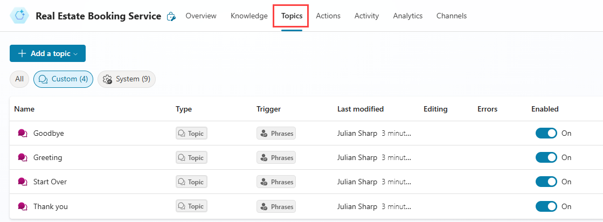
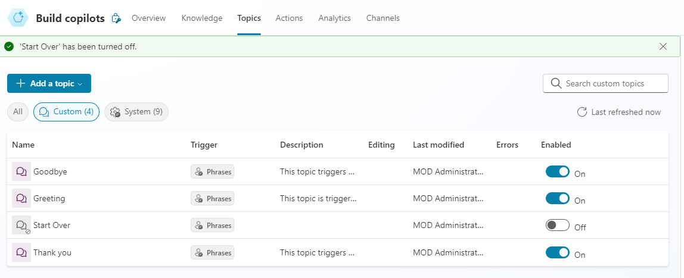

---
lab:
  title: Gérer les rubriques
  module: Manage topics in Microsoft Copilot Studio
---

# Gérer les rubriques

## Scénario

Dans cet exercice, vous allez :

- Gérer les rubriques existantes
- Créer et modifier des rubriques à l’aide du langage naturel
- Créer une rubrique manuellement à l’aide d’expressions déclencheuses

Cet exercice devrait prendre environ **30** minutes.

## Contenu du didacticiel

- Comment configurer les rubriques de l’assistant

## Étapes de labo de haut niveau

- Désactiver des rubriques
- Créer et modifier des rubriques en utilisant le langage naturel
- Créer une rubrique et ajouter des expressions déclencheuses
  
## Prérequis

- Avoir terminé le **Labo : créer un assistant initial**

## Procédure détaillée

## Exercice 1 – Supprimer des rubriques

Dans cet exercice, vous allez supprimer les rubriques d’un assistant.

### Tâche 1.1 – Désactiver des rubriques

1. Accédez au portail `https://copilotstudio.microsoft.com` Microsoft Copilot Studio et vérifiez que vous êtes dans l’environnement approprié.

1. Sélectionnez le bouton **Test** en haut à droite de l’écran pour fermer le panneau de test, le cas échéant.

1. Sélectionnez **Assistants** dans le volet de navigation de gauche.

    

1. Sélectionnez l’assistant que vous avez créé dans le labo précédent.

1. Sélectionnez l’onglet **Rubriques**.

    

1. Cliquez sur **Activé** pour passer sur **Désactivé** pour la rubrique **Redémarrage**.

    

## Exercice 2 – Créer des rubriques avec le langage naturel

Dans cet exercice, vous allez créer des rubriques dans un assistant et ajouter des expressions déclencheuses.

### Tâche 2.1 – Ajouter une rubrique à l’aide de Copilot

1. Sélectionnez **+ Ajouter un sujet**, puis sélectionnez **Créer à partir d’une description avec Copilot**. Une nouvelle fenêtre s’affiche.

    

    

1. Dans la zone de texte **Nommer votre rubrique**, entrez **`Customer Details`**.

1. Dans la zone de texte **Créer une rubrique pour…**, entrez **`Ask the customer for their name and email address.`**.

1. Sélectionnez **Créer**.

1. Cliquez sur **Enregistrer**.

### Tâche 2.2 – Mettre à jour les nœuds avec le langage naturel

1. Si le volet **Modifier avec Copilot** n’apparaît pas à droite du volet **Détails du client**, sélectionnez l’icône **Copilot** dans la partie supérieure du canevas de création.

    

1. Sélectionnez le second nœud **Question**, **Quelle est votre adresse e-mail ?**

    

1. Dans le volet **Modifier avec Copilot**, dans le champ **Que voulez-vous faire ?**, saisissez le texte suivant :

    `Change "What is your email address?" to say thank you to the Name variable from the previous node and then proceed to ask the email address question.`

1. Sélectionnez **Mettre à jour**.

    

    

    > **Note** : le message doit être mis à jour pour inclure la variable *Name* du nœud précédent et doit ressembler à la capture d’écran ci-dessus. Si la modification avec Copilot n’a pas mis à jour correctement le nœud question, sélectionnez Annuler et réessayez avec une autre invite.

1. Cliquez sur **Enregistrer**.

### Tâche 2.3 – Ajouter des nœuds avec le langage naturel

En plus de mettre à jour de nouveaux nœuds, vous pouvez utiliser Copilot pour en ajouter de nouveaux.

1. Assurez-vous qu’aucun nœud n’est sélectionné en cliquant dans l’espace vide autour des nœuds.

1. Dans le volet **Modifier avec Copilot**, dans le champ **Que voulez-vous faire ?**, saisissez le texte suivant :

    `Summarize the information collected in an adaptive card`

1. Sélectionnez **Mettre à jour**.

1. Un nœud Message avec une carte adaptative est ajouté à la fin de la rubrique.

    

1. Sélectionnez la zone **Média** dans la carte adaptative. Les propriétés de la carte adaptative devraient s’afficher sur le côté droit de l’écran.

    

   La formule de votre carte adaptative devrait ressembler à celle ci-dessus. Si ce n’est pas le cas, vous pouvez copier-coller la formule ci-dessous :

    ```json
    {
    type: "AdaptiveCard", 
        body: 
        [
            {
                type: "TextBlock",
                size: "Medium",
                weight: "Bolder",
                text: "Summary"    
            },
            {
                type: "FactSet",
                facts: 
                [
                    {
                        title: "Full Name",
                        value: Text(Topic.Name)
                    },
                    {
                        title: "Email Address",
                        value: Text(Topic.EmailAddress)
                    }
                ]
            },
            {
                type: "TextBlock",
                text: "Thank you for providing the information."
            }
        ]
    }
    ```

1. L’ouverture des propriétés de la carte adaptative entraîne la fermeture du volet **Modifier avec Copilot**. Vous devez donc sélectionner l’icône **Copilot** pour le rouvrir.

1. Assurez-vous qu’aucun nœud n’est sélectionné en cliquant dans l’espace vide autour des nœuds.

1. Dans le champ **Que voulez-vous faire ?**, saisissez le texte suivant :

    `Add a new multiple choice question to prompt the user if the details are correct with two options Yes or No`

1. Sélectionnez **Mettre à jour**.

1. Un nouveau nœud Question est ajouté à la fin de la rubrique avec des options que l’utilisateur peut sélectionner.

    

1. Cliquez sur **Enregistrer**.

### Tâche 2.4 – Tester la rubrique

1. Sélectionnez le bouton **Test** en haut à droite de l’écran pour ouvrir le panneau de test, s’il est fermé.

1. Sélectionnez l’icône **Commencer une nouvelle conversation** en haut du panneau de test.

1. Dans la zone de texte **Poser une question ou décrire ce dont vous avez besoin**, entrez **`Customer information`**.

1. Entrez votre nom et votre adresse e-mail.

1. Sélectionnez **Oui**.

## Exercice 3 – Créer des rubriques manuellement

Les rubriques peuvent être créées manuellement avec des expressions déclencheuses.

### Tâche 3.1 – Créer une rubrique à partir de zéro

1. Sélectionnez l’onglet **Rubriques** dans la barre supérieure du **service de réservation immobilière**.

1. Sélectionnez **+ Ajouter une rubrique**, puis **Créer à partir de zéro**.

1. Sélectionnez l’icône **Détails** pour ouvrir la boîte de dialogue des détails de la rubrique.

    

1. Dans le champ **Nom**, entrez le texte suivant :

    `Book a Real Estate Showing`

1. Dans le champ **Nom d’affichage**, entrez le texte suivant :

    `Book`

1. Dans le champ **Description**, entrez le texte suivant :

    `Select the property and requested date and create a booking request`

1. Cliquez sur **Enregistrer**.

### Tâche 3.2 – Ajouter des expressions déclencheuses

1. Sélectionnez **Modifier** sous **Phrases** dans **Déclencheur**.

    

1. Entrez `I want to book a real estate showing` sous **Ajouter des expressions** et sélectionnez l’icône **+**.

1. Entrez `Schedule a real estate showing` sous **Ajouter des expressions** et sélectionnez l’icône **+**.

1. Entrez `Arrange the viewing for a real estate property` sous **Ajouter des expressions** et sélectionnez l’icône **+**.

1. Entrez `Set up an appointment to view a house` sous **Ajouter des expressions** et sélectionnez l’icône **+**.

1. Entrez `Plan a property viewing` sous **Ajouter des expressions** et sélectionnez l’icône **+**.

1. Sélectionnez **Enregistrer**.
