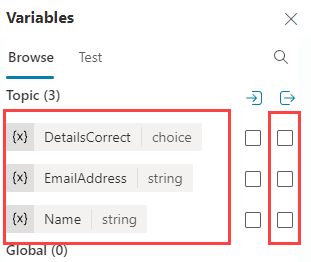
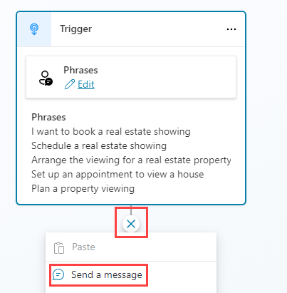
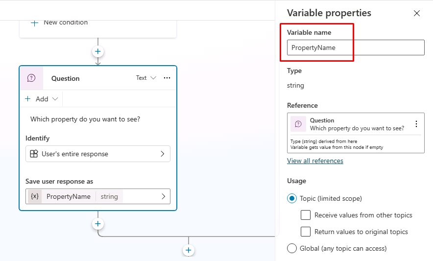

---
lab:
  title: Gérer les nœuds
  module: Manage topics in Microsoft Copilot Studio
---

# Gérer les nœuds

## Scénario

Dans cet exercice, vous allez :

- Créer le flux conversationnel
- gérer les variables ;

Cet exercice devrait prendre environ **30** minutes.

## Contenu du didacticiel

- Comment ajouter des nœuds à une rubrique pour créer le flux conversationnel

## Étapes de labo de haut niveau

- Configurer l’étendue des variables
- Créer et modifier des nœuds
- Déployer et tester l’agent
  
## Prérequis

- Vous devez avoir terminé le **Labo : gérer les rubriques**.

## Procédure détaillée

## Exercice 1 : étendue des variables

Les variables sont accessibles par d’autres rubriques.

### Tâche 1.1 : configurer l’étendue des variables

1. Accédez au portail Microsoft Studio `https://copilotstudio.microsoft.com` et vérifiez que vous êtes dans l’environnement approprié.

1. Sélectionnez le bouton **Test** en haut à droite de l’écran pour fermer le panneau de test, le cas échéant.

1. Sélectionnez **Assistants** dans le volet de navigation de gauche.

1. Sélectionnez l’assistant que vous avez créé dans le labo précédent.

1. Sélectionnez l’onglet **Rubriques**.

1. Sélectionnez la rubrique **Détails du client**.

1. Sélectionnez **Variables** dans la barre supérieure pour ouvrir le volet Variables.

1. Cochez les cases à droite pour les trois variables de rubrique.

    

1. Cliquez sur **Enregistrer**.

## Exercice 2 : créer des rubriques manuellement

Le flux conversationnel d’une rubrique peut être créé manuellement en ajoutant des nœuds.

### Tâche 2.1 : ajouter un nœud de message

1. Sélectionnez l’onglet **Rubriques**.

1. Sélectionnez la rubrique **Réserver une visite immobilière**.

1. Sélectionnez l’icône **+** sous le nœud Déclencheur, puis sélectionnez **Envoyer un message**.

    

1. Dans le champ **Entrer un message**, entrez le texte suivant :

    `Hi, I can help you with booking a real estate property showing.`

1. Cliquez sur **Enregistrer**.

### Tâche 2.2 : ajouter un nœud de gestion des rubriques

1. Sélectionnez l’icône **+** sous le nœud **Message**, **Gestion des rubriques**, puis **Accéder à une autre rubrique**, puis **Détails du client**.

    

1. Cliquez sur **Enregistrer**.

### Tâche 2.3 : ajouter un nœud de condition

1. Sélectionnez l’icône **+** sous le nœud **Redirection**, puis sélectionnez **Ajouter une condition**.

1. Dans le nœud **Condition**, sélectionnez la variable **DetailsCorrect**.

1. Sélectionnez **est égal à**.

1. Sélectionnez **Oui**.

    

1. Cliquez sur **Enregistrer**.

### Tâche 2.4 : ajouter des nœuds de question

1. Sélectionnez l’icône **+** sous le nœud **Condition** de gauche, puis sélectionnez **Poser une question**.

1. Dans le champ **Entrer un message**, entrez le texte suivant :

    `Which property do you want to see?`

1. Pour **Identifier**, sélectionnez **Réponse complète de l’utilisateur**.

1. Sélectionnez la variable dans **Enregistrer la réponse de l’utilisateur comme** et entrez **`PropertyName`** comme **nom de la variable**.

    

1. Cliquez sur **Enregistrer**.

1. Sélectionnez l’icône **+** sous le nouveau nœud **Question**, puis sélectionnez **Poser une question**.

1. Dans le champ **Entrer un message**, entrez le texte suivant :

    `What date and time do you want to see the property?`

1. Pour **Identifier**, choisissez **Date et heure**.

1. Sélectionnez la variable dans **Enregistrer la réponse de l’utilisateur comme** et entrez **`DateTime`** comme **nom de la variable**.

1. Cliquez sur **Enregistrer**.

### Tâche 2.5 : tester l’assistant

1. Le cas échéant, sélectionnez le bouton **Tester** en haut à droite de l’écran pour ouvrir le panneau de test.

1. Sélectionnez les **trois points** en haut du panneau de test en haut à droite de l’écran.

1. Le cas échéant, activez **Suivi des rubriques**.

    

1. Sélectionnez l’icône **Commencer une nouvelle conversation** en haut du panneau de test.

1. Lorsque le message **Début de conversation** s’affiche, votre assistant lance une conversation. En réponse, saisissez une phrase déclencheur pour la rubrique que vous avez créée :

    `I want to book a real estate showing`

1. L’assistant répond avec la question « Quel est votre nom ? », comme illustré dans l’image suivante.

    

1. Entrez votre nom et votre adresse e-mail.

1. Une fois les informations fournies, une carte adaptative affiche les informations que vous avez entrées et vous demande si les détails sont corrects. Sélectionnez **Oui**.

1. Entrez `555 Oak Lane, Denver, CO 80203` à l’invite **Quelle propriété souhaitez-vous afficher ?**

1. Entrez `Tomorrow 10:00 AM` à l’invite **Pour quelle date et quelle heure souhaitez-vous afficher la propriété ?**

    

## Exercice 3 : déployer l’assistant

### Tâche 3.1 : configurer l’authentification

1. Sélectionnez **Paramètres** dans l’angle supérieur droit du **service de réservation immobilière**.

1. Sélectionnez l’onglet **Sécurité**.

1. Sélectionnez la vignette **Authentification**.

    

1. Sélectionnez **Aucune authentification**.

1. Cliquez sur **Enregistrer**.

1. Sélectionnez **OK** dans la fenêtre de confirmation.

1. Cliquez sur le **X** dans le coin supérieur droit pour fermer les **Paramètres**.

### Tâche 3.2 : publier l’assistant

1. Sélectionnez **Publier** en haut à droite, puis sélectionnez **Publier** à nouveau.

### Tâche 3.3 : site web de démonstration

1. Sélectionnez les **trois points** en regard du bouton **Paramètres** en haut à droite de l’écran, puis sélectionnez **Aller au site web de démonstration**.

1. Dans la zone de texte **Tapez votre message**, entrez **`I want to book a property`**.

1. Répondez aux invites pour tester l’agent.
