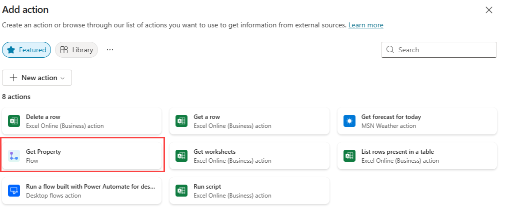

---
lab:
  title: Créer des actions d’agent
  module: Enhance Microsoft Copilot Studio copilots
---

# Créer des actions de copilote

## Scénario

Dans ce labo, vous allez :

- Créer des actions d’agent

## Contenu du didacticiel

- Comment ajouter l’utilisation de Power Automate pour accéder aux données dans Microsoft Dataverse

## Étapes de labo de haut niveau

- Créer un flux de cloud Power Automate pour récupérer des données Dataverse avec une action d’assistant
- Créer un flux de cloud Power Automate pour créer des données Dataverse avec une action d’assistant
  
## Prérequis

- Vous devez avoir terminé le **Labo : utiliser des entités**

## Procédure détaillée

## Exercice 1 : créer une action d’assistant pour récupérer des données à partir de Dataverse

Microsoft Copilot Studio peut accéder aux données dans Microsoft Dataverse à l’aide de flux de cloud Power Automate.

### Tâche 1.1 : créer un flux Power Automate pour récupérer une propriété

1. Accédez au portail `https://copilotstudio.microsoft.com` Microsoft Copilot Studio et vérifiez que vous êtes dans l’environnement approprié.

1. Sélectionnez **Assistants** dans le volet de navigation de gauche.

1. Sélectionnez le **service de réservation immobilière** que vous avez créé dans le labo précédent.

1. Sélectionnez l’onglet **Actions**.

1. Sélectionnez **+ Ajouter une action**.

    

1. Sélectionnez le filtre **Flux**, puis **Exécuter un flux avec Power Automate pour le bureau**.

1. Connectez-vous à Power Automate si nécessaire.

    

1. Sélectionnez **Exécuter un flux à partir de Copilot** en haut à gauche de l’écran et entrez `Get Property` comme nom du flux.

1. Sélectionnez l’étape de déclencheur **Exécuter un flux à partir de Copilot**, puis cliquez sur **+ Ajouter une entrée**.

1. Sélectionnez **Texte**.

1. Entrez l’**entrée** `Bedrooms`, puis `Number of Bedrooms` pour **Veuillez entrer votre entrée**.

    

1. Sélectionnez l’icône **+** entre les deux étapes du flux, puis sélectionnez **Ajouter une action**.

1. Entrez `Dataverse` dans le **champ de recherche** et sélectionnez **Afficher plus** pour le connecteur **Microsoft Dataverse**.

    

1. Sélectionnez l’action **Répertorier des lignes**.

1. Si vous y êtes invité, sélectionnez **OAuth**, puis **Se connecter**.

    > **Note :** si vous voyez une erreur « **Échec de création d’une connexion OAuth** », vous devrez peut-être autoriser les fenêtres contextuelles dans votre navigateur.

    

    

1. Sélectionnez la table **Biens immobiliers**.

1. Entrez `contoso_bedrooms eq ` (avec une espace après **eq**) dans le champ **Filtrer les lignes**.

1. Lorsque le champ **Filtrer les lignes** est toujours sélectionné, sélectionnez l’icône **éclair** à droite, puis sélectionnez le paramètre **Chambres**.

    

1. Dans le volet principal de Power Automate, sélectionnez l’action **Répondre à Copilot**, puis sélectionnez **+ Ajouter une sortie**.

1. Sélectionnez **Texte**.

1. Entrez `PropertyId` pour **Entrer un nom**

1. Sélectionnez le champ **Entrer une valeur de réponse**, puis sélectionnez **fx (Insérer une expression).**

1. Entrez l’expression suivante dans le champ :

    ```
    first(outputs('List_rows')?['body/value'])['contoso_realestatepropertyid']
    ```

    

1. Sélectionnez **Ajouter**.

1. Sélectionnez **+ Ajouter une sortie**.

1. Sélectionnez **Texte**.

1. Entrez `PropertyName` pour **Entrer un nom**

1. Sélectionnez le champ **Entrer une valeur de réponse**, puis sélectionnez **fx (Insérer une expression).**

1. Entrez l’expression suivante :

    ```
    first(outputs('List_rows')?['body/value'])['contoso_propertyname']
    ```

1. Sélectionnez **Ajouter**.

1. Sélectionnez l’onglet **Paramètres** dans le volet **Répondre à Copilot**.

1. Vérifiez que la **réponse asynchrone** est définie sur **Désactivé**.

    

1. Sélectionnez **Enregistrer** en haut à droite de la page.

1. Attendez la fin de l’enregistrement, puis fermez l’onglet Power Automate.

### Tâche 1.2 : ajouter une action d’assistant pour récupérer une propriété

1. Sélectionnez **Actualiser** dans la boîte de dialogue Copilot Studio pour afficher le nouveau flux.

1. Sélectionnez le flux **Obtenir la propriété**.

    

1. Cliquez sur **Suivant**.

1. Cliquez sur **Suivant**.

1. Cliquez sur **Terminer**.

### Tâche 1.3 : ajouter l’action d’assistant Obtenir la propriété à la rubrique

1. Sélectionnez l’onglet **Rubriques**.

1. Sélectionnez la rubrique **Réserver une visite immobilière**.

1. Sélectionnez l’icône **+** sous le nœud **Question De combien de chambres avez-vous besoin ?**, sélectionnez **Appeler une action**, puis sélectionnez le flux **Obtenir la propriété**.

    

1. Sélectionnez la **variable NumberofBedrooms** pour le paramètre d’entrée **Chambres**.

    

1. Sélectionnez les **trois points** dans le nœud **Quelle propriété voulez-vous voir ?**, puis sélectionnez **Supprimer**.

1. Sélectionnez l’icône **+** sous le nœud **Action**, puis sélectionnez **Envoyer un message**.

1. Dans le champ **Entrer un message**, entrez `Property ` (avec un espace après).

1. Dans le même nœud, sélectionnez l’icône **{X} (Insérer une variable)**, puis la variable **PropertyName**.

    

1. Cliquez sur **Enregistrer**.

## Exercice 2 : créer une action d’assistant pour créer des données dans Dataverse

Microsoft Copilot Studio peut créer des données dans Microsoft Dataverse à l’aide de flux cloud Power Automate.

### Tâche 2.1 - Créer un flux Power Automate pour effectuer une réservation

1. Sélectionnez l’onglet **Actions** dans **Service de réservation immobilière**.

1. Sélectionnez **+ Ajouter une action**.

1. Faites défiler la page et sélectionnez **Créer un flux**.

1. Sélectionnez **Exécuter un flux à partir de Copilot** en haut à gauche de l’écran et entrez `Create Booking Request` pour le nom du flux.

1. Sélectionnez l’étape de déclencheur **Exécuter un flux à partir de Copilot**, puis cliquez sur **+ Ajouter une entrée**.

1. Sélectionnez **Texte**.

1. Entrez `PropertyId` pour **Entrée** et `Property` pour **Saisissez votre entrée**.

1. Cliquez sur **+ Ajouter une entrée**.

1. Sélectionnez **Texte**.

1. Entrez `ViewerName` pour **Entrée** et `Viewer Name` pour **Saisissez votre entrée**.

1. Cliquez sur **+ Ajouter une entrée**.

1. Sélectionnez **Texte**.

1. Entrez `ViewerEmail` pour **Entrée** et `Viewer Email` pour **Saisissez votre entrée**.

    

1. Sélectionnez l’icône **+** entre les deux étapes du flux, puis sélectionnez **Ajouter une action**.

1. Entrez `Dataverse` dans le **champ de recherche** et sélectionnez **Afficher plus** pour le connecteur **Microsoft Dataverse**.

1. Sélectionnez l’action **Ajouter une nouvelle ligne**.

1. Sélectionnez **Demandes de réservation** pour le nom de la table.

1. Entrez `Copilot booking` dans le champ **Nom de la réservation**.

1. Sélectionnez **Afficher tout** sous **Paramètres avancés**.

1. Entrez `contoso_bookingrequests()` dans le champ **Propriété (Propriétés immobilières)**, déplacez le curseur entre les parenthèses, sélectionnez l’icône **éclair**, puis le paramètre **PropertyId**.

1. Sélectionnez le champ **E-mail de la visionneuse**, puis l’icône **éclair**, et enfin le paramètre **ViewerEmail**.

1. Sélectionnez le champ **Nom de la visionneuse**, puis l’icône **éclair**, et enfin le paramètre **ViewerName**.

    

1. Sélectionnez l’action **Répondre à Copilot**.

1. Sélectionnez l’onglet **Settings** (Paramètres).

1. Vérifiez que la **réponse asynchrone** est définie sur **Désactivé**.

1. Cliquez sur **Enregistrer** en haut à droite de la fenêtre.

1. Attendez la fin de l’enregistrement, puis fermez l’onglet Power Automate.

### Tâche 2.2 : ajouter une action d’assistant pour créer une demande de réservation

1. Sélectionnez **Actualiser** dans la boîte de dialogue Copilot Studio pour afficher le nouveau flux.

1. Sélectionnez le flux **Créer une demande de réservation**.

1. Cliquez sur **Suivant**.

1. Cliquez sur **Suivant**.

1. Cliquez sur **Terminer**.

### Tâche 2.3 : ajouter l’action d’assistant Créer une demande de réservation à la rubrique

1. Sélectionnez l’onglet **Rubriques**.

1. Sélectionnez la rubrique **Réserver une visite immobilière**.

1. Sélectionnez l’icône **+** sous le nœud **À quelle date et quelle heure souahitez-vous voir la propriété ?**, puis **Appeler une action** et enfin le flux **Créer une demande de réservation**.

1. Sélectionnez la variable **PropertyId** pour le paramètre d’entrée **PropertyId**.

1. Sélectionnez la variable **Name** pour le paramètre d’entrée **ViewerName**.

1. Sélectionnez la variable **EmailAddress** pour le paramètre d’entrée **ViewerEmail**.

1. Sélectionnez l’icône **+** sous le nouveau nœud **Action**, puis **Gestion des rubriques**, puis **Accéder à une autre rubrique** et enfin **Fin de la conversation**.

1. Cliquez sur **Enregistrer**.

1. Sélectionnez **Publier**, puis **Publier** à nouveau.

## Exercice 3 : tester les actions d’assistant

### Tâche 3.1 - Effectuer une demande de réservation

1. Cliquez sur le bouton **Tester** en haut à droite de l’écran pour ouvrir le volet de test s’il est fermé.

1. Sélectionnez les **trois points** en haut du panneau de test en haut à droite de l’écran.

    

1. Le cas échéant, activez **Suivi des rubriques**.

1. Sélectionnez l’icône **Commencer une nouvelle conversation** en haut du panneau de test.

1. Lorsque le message **Début de conversation** s’affiche, votre assistant lance une conversation. En réponse, saisissez une phrase déclencheur pour la rubrique que vous avez créée :

    `I want to book a real estate showing`

1. Saisissez les informations suivantes :

    ```
    Name: <Your name>
    Email address: <Your email address>
    ```

1. Une fois les informations fournies, une carte adaptative affiche les informations que vous avez entrées et vous demande si les détails sont corrects. Sélectionnez **Oui**.

1. Sélectionnez **House** pour le type d’invite de propriété.

1. Entrez `3` pour le nombre d’invites de chambres.

    

1. Entrez `Tomorrow 2:00 PM` pour l’invite **À quelle date et quelle heure souhaitez-vous afficher la propriété ?**.

1. Sélectionnez **Oui** à l’invite **Cela répond-il à votre question ?**.

1. Sélectionnez une note.

1. Sélectionnez **Non** à l’invite **Puis-je vous aider avec autre chose ?**.

### Tâche 3.2 - Vérifier la demande de réservation

1. S’il n’est pas encore ouvert, accédez à `https://make.powerapps.com` dans un nouvel onglet.

1. Vérifiez que vous êtes dans l’environnement approprié.

1. Sélectionnez **Lire** dans l’application pilotée par modèle **Gestion des propriétés immobilières**.

1. Dans le volet de navigation de gauche, sélectionnez **Demandes de requêtes**.

    
