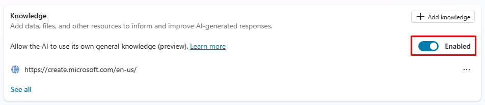

---
lab:
  title: Utiliser l’IA générative dans Microsoft Copilot Studio
  module: Enhance Microsoft Copilot Studio copilots
---

# Utiliser l’IA générative dans Microsoft Copilot Studio

## Scénario

Dans ce labo, vous allez :

- Créer des actions de copilote

## Contenu du didacticiel

- Comment utiliser la fonctionnalité de réponses génératives pour améliorer les réponses de votre copilote

## Étapes de labo de haut niveau

- Activer l’IA générative
- Ajouter des connaissances
  
## Prérequis

- Avoir effectué le **Labo : créer des actions Copilot**

## Procédure détaillée

## Exercice 1 - Configurer l’IA générative

### Tâche 1.1 – Activer l’IA générative

1. S’il n’est pas encore ouvert, accédez au portail Microsoft Copilot Studio `https://copilotstudio.microsoft.com` et vérifiez que vous êtes dans l’environnement approprié.

1. Sélectionnez **Copilotes** dans le volet de navigation de gauche.

1. Sélectionnez le **service de réservation immobilière** que vous avez créé dans le labo précédent.

1. Cliquez sur le bouton **Paramètres** en haut à droite de l’écran.

1. Sélectionnez l’onglet **IA générative**.

1. Sélectionnez **Générative** sous **Comment votre copilote doit-il interagir avec les personnes ?**.

1. Sélectionnez **Moyen - Plus équilibré** pour **Quel niveau de modération de contenu souhaitez-vous appliquer ?**.

1. Cliquez sur **Enregistrer**.

    

1. Fermez le menu **Paramètres** en sélectionnant l’icône **X** en haut à droite de Copilot Studio.

### Tâche 1.2 – Utiliser des réponses génératives dans la rubrique Boosting conversationnel

1. Sélectionnez l’onglet **Rubriques**, puis le filtre **Système**.

1. Sélectionnez la rubrique **Boosting conversationnel**.

    

1. Examinez le nœud **Créer des réponses génératives**.

### Tâche 1.3 – Activer les connaissances

1. Sélectionnez l’onglet **Vue d’ensemble**.

1. Vérifiez que les connaissances générales sont **activées**.

    

1. Vous devez voir le site web public ajouté en tant que connaissances dans un labo antérieur.

### Tâche 1.4 - Configurer l’authentification

1. Sélectionnez **Paramètres** en haut à droite de l’écran.

1. Sélectionnez l’onglet **Sécurité**.

1. Sélectionnez la vignette **Authentification**.

1. Sélectionnez **Authentifier avec Microsoft**.

1. Cliquez sur **Enregistrer**.

1. Cliquez sur **Enregistrer**.

1. Fermez le menu **Paramètres** en sélectionnant le **X** en haut à droite de Copilot Studio.

1. Sélectionnez **Publier**, puis **Publier** à nouveau.

## Exercice 2 - Ajouter des connaissances

### Tâche 2.1 - Ajouter des connaissances à partir de Dataverse

1. Sélectionnez l’onglet **Connaissances**.

1. Sélectionnez **+ Ajouter des connaissances**.

1. Sélectionnez **Dataverse**.

1. Sélectionnez la table **Real Estate Property**.

    

1. Cliquez sur **Suivant**.

1. Cliquez sur **Suivant**.

1. Sélectionnez **Ajouter**.

### Tâche 2.2 - Ajouter des connaissances à partir de fichiers

1. Téléchargez cette [**étude de cas Microsoft**](https://download.microsoft.com/documents/customerevidence/Files/4000007499/SummitRealtyCaseStudy.docx) ou [**SummitRealtyCaseStudy.docx**](../../Allfiles/SummitRealtyCaseStudy.docx) à partir de GitHub.

1. Sélectionnez **+ Ajouter des connaissances**.

1. Sélectionnez **Fichiers**.

1. Sous **Charger des fichiers**, parcourez et sélectionnez l’étude de cas que vous avez téléchargée.

    

1. Sélectionnez **Ajouter**.

    

## Exercice 3 - Configurer la rubrique de base

### Tâche 3.1 - Utiliser des réponses génératives dans la rubrique système de base

1. Sélectionnez l’onglet **Rubriques**, puis le filtre **Système**.

1. Sélectionnez la rubrique **de base**.

    

1. Sélectionnez les **trois points** dans le nœud **Message**, puis **Supprimer**.

1. Sélectionnez l’icône **+** sous le nœud **Condition**, puis **Avancé**, et enfin **Réponses génératives**.

1. Sélectionnez **Activity.Text** pour le champ **Entrée**.

1. Sélectionnez **Modifier** sous **Sources de données**.

    

1. Sélectionnez **Rechercher uniquement les sources sélectionnées**.

1. Sélectionnez la table Dataverse **Propriété immobilière**.

1. Désélectionner **Autoriser l’IA à utiliser ses propres connaissances générales**.

1. Cochez la case **Personnaliser** sous **Quel niveau de modération du contenu souhaitez-vous appliquer ?**, puis sélectionnez **Moyen**.

    

1. Cliquez sur **Enregistrer**.

## Exercice 4 - Tester l’IA générative

### Tâche 4.1 Tester les connaissances du copilote

1. Le cas échéant, sélectionnez le bouton **Tester** en haut à droite de l’écran pour ouvrir le panneau de test.

1. Sélectionnez l’icône **Carte de conversation** en haut du volet de test, en haut à droite de l’écran.

    

1. Sélectionnez **Activé**.

1. Sélectionnez l’icône **Commencer une nouvelle conversation** en haut du panneau de test.

1. Explorez le copilote et découvrez comment il utilise les sources de connaissances.
