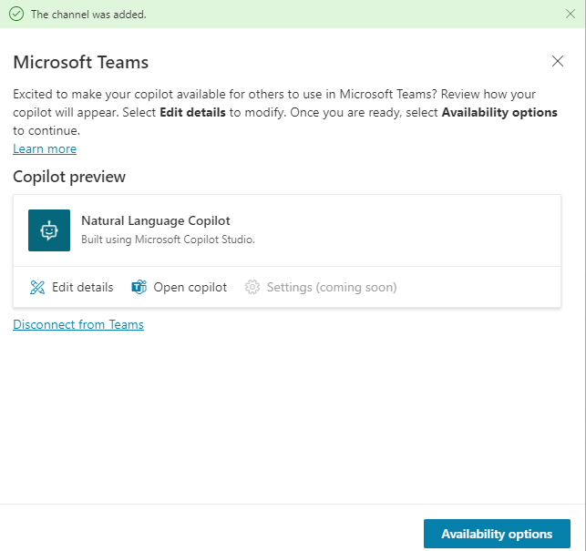

---
lab:
  title: "Déployer l’assistant dans Microsoft\_Teams"
  module: Create an agent with Microsoft Copilot Studio and Dataverse for Teams
---

# Déployer l’assistant dans Microsoft Teams

## Scénario

Dans ce labo, vous allez :

- Créer des actions d’agent

## Contenu du didacticiel

- Comment déployer un assistant dans Microsoft Teams

## Étapes de labo de haut niveau

- Publier
- Déployer l’assistant dans Microsoft Teams
  
## Prérequis

- Avoir effectué le **Labo : utiliser l’IA générative dans Microsoft Copilot Studio**

## Procédure détaillée

## Exercice 1 : publier l’assistant

### Tâche 1.1 – Publier le contenu le plus récent

1. Accédez au portail `https://copilotstudio.microsoft.com` Microsoft Copilot Studio et vérifiez que vous êtes dans l’environnement approprié.

1. Sélectionnez **Assistants** dans le volet de navigation de gauche.

1. Sélectionnez l’assistant que vous avez créé dans le labo précédent.

1. Sélectionnez **Publier**, puis **Publier** à nouveau.

   

   > **Note :** la publication peut prendre quelques minutes.

## Exercice 2 - Canaux

Maintenant que votre agent est publié, vous pouvez le mettre à la disposition des utilisateurs dans Teams. De cette façon, vous, vos coéquipiers et l’ensemble de votre organisation pouvez interagir avec lui.

### Tâche 2.1 – Canal Microsoft Teams

1. Lorsque votre agent s’ouvre dans Microsoft Copilot Studio, sélectionnez l’onglet **Canaux**.

    

1. Sélectionnez la mosaïque **Microsoft Teams**.

    

1. Sélectionnez **Activer Teams**.

    

1. Cliquez sur **Options de disponibilité**.

    

1. Sélectionnez **Copier le lien**.

1. Sélectionnez **Présenter à mes collègues et aux utilisateurs partagés**.

1. Sélectionnez votre utilisateur.

1. Sélectionnez la flèche arrière en haut à gauche du volet.

1. Sélectionnez **Partager**.

### Tâche 2.2 - Microsoft Teams

1. Dans un autre onglet, accédez à Microsoft Teams `https://teams.microsoft.com`.

1. Connectez-vous à Teams si nécessaire.

1. Sélectionnez **Teams** dans le volet de navigation gauche.

1. Une équipe nommée **Contoso** avec un canal **Général** s’affiche.

1. Ouvrez un nouvel onglet et accédez au lien URL copié dans la tâche précédente.

1. Sélectionnez **Annuler** dans la boîte de dialogue de **Ce site essaye d’ouvrir Microsoft Teams**.

1. Sélectionnez **Utiliser l’application web à la place**.

1. Sélectionnez **Ajouter**.

    

1. Testez l’assistant.

    
