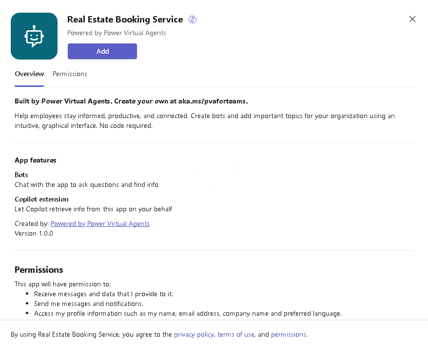

---
lab:
  title: "Déployer l’assistant dans Microsoft\_Teams"
  module: Create an agent with Microsoft Copilot Studio and Dataverse for Teams
---

# Déployer l’assistant dans Microsoft Teams

## Scénario

Dans cet exercice, vous allez :

- Déployer l’agent sur un canal Microsoft Teams

Cet exercice devrait prendre environ **10** minutes.

## Contenu du didacticiel

- Comment déployer un assistant dans Microsoft Teams

## Étapes de labo de haut niveau

- Publier
- Déployer l’assistant dans Microsoft Teams
  
## Prérequis

- Avoir effectué le **Labo : utiliser l’IA générative dans Microsoft Copilot Studio**

## Procédure détaillée

## Exercice 1 : publier l’assistant

### Tâche 1.1 – Publier le contenu le plus récent

1. Accédez au portail `https://copilotstudio.microsoft.com` Microsoft Copilot Studio et vérifiez que vous êtes dans l’environnement approprié.

1. Sélectionnez **Assistants** dans le volet de navigation de gauche.

1. Sélectionnez l’assistant que vous avez créé dans le labo précédent.

1. Sélectionnez **Publier**, puis **Publier** à nouveau.
   > **Note :** la publication peut prendre quelques minutes.

## Exercice 2 - Canaux

Maintenant que votre agent est publié, vous pouvez le mettre à la disposition des utilisateurs dans Teams. De cette façon, vous, vos coéquipiers et l’ensemble de votre organisation pouvez interagir avec lui.

### Tâche 2.1 – Canal Microsoft Teams

1. Lorsque votre agent s’ouvre dans Microsoft Copilot Studio, sélectionnez l’onglet **Canaux**.

1. Sélectionnez la vignette **Teams et Microsoft 365 Copilot**.

1. Sélectionnez **Ajouter un canal**.

1. Cliquez sur **Options de disponibilité**.

    

1. Sélectionnez **Afficher l’agent dans Teams**

1. Sélectionnez **Annuler** dans la boîte de dialogue de **Ce site essaye d’ouvrir Microsoft Teams**.

1. Dans la fenêtre contextuelle, sélectionnez **Annuler**, puis sélectionnez **Utiliser l’application web à la place**.

1. Sélectionnez **Ajouter** pour ajouter l’agent à Teams.

    

1. sélectionnez **Ouvrir**. Je souhaite 

1. Testez l’assistant.

    
